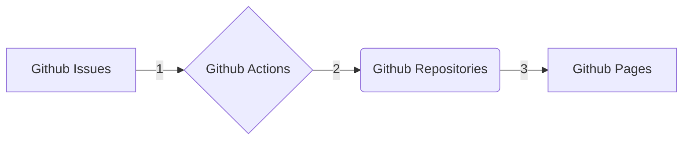

我用过很多网站工具生成博客站点，Jekyll、wordpress、Hexo，这类工具功能非常强大，但使用起来有些复杂(比如我之前发布的 Wordpress 内容)原本博客就是一种内容创作、记录日常所见所闻所想的网络日志，但是自从用了上述这类工具后，把精力都耗在了折腾网站主题和各种功能的扩展上，背离了博客写作的初衷。
而且上述这类博客工具万一哪天不存在了，博客文章就无法发布了，所以我急需一个满足如下功能的博客平台。

- [x] 支持Markdown
- [x] 支持在线编辑及预览
- [x] 支持下载文章所有内容至本地
- [x] 文章数据可迁移
- [x] 博客平台免费
- [x] 博客平台长期有效，必须是大厂
- [x] 可以自定义域名

根据上述需求，我选择了Github,发现Github就是天然的CMS平台，功能无比强大，还可以作为知识库。Github lssues可以作为CMS后台内容管理、Github Actions 作为工作流，最后通过Github Pages服务进行发布。

对于刚入门的博主来说、所有的核心要点就是对于Markdown语法的掌握。通过这种博客写作方式，能让你更注重文章内容创作，而不必纠结博客如何生成网站，或者其他功能的扩展。

推荐这个大牛开发的Github 博客生成工具 [Gmeek](https://blog.meekdai.com/)

这类博客写作方式，适合以下人群

- [x] 编辑
- [x] 教育
- [x] 技术
- [x] 科研

## 参考案例

- [GitHub 入门文档](https://docs.github.com/zh/get-started)
- [Gmeek](https://github.com/Meekdai/Gmeek)
- [ruanyf](https://github.com/ruanyf)
